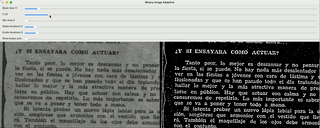
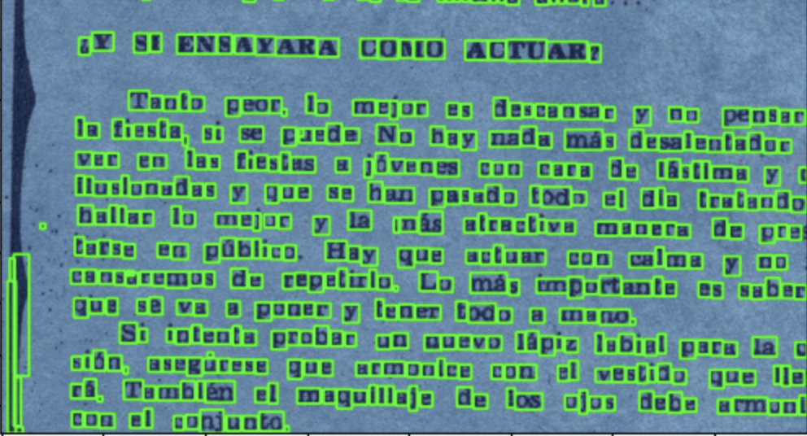

# computerVision
cv projects

### Morphological operations
The project use the following operations to clean up the image:

* Erosion: `cv2.erode`
* Dilation: `cv2.dilate`
* Opening: use `cv2.morphologyEx` with `cv2.MORPH_OPEN`
* Closing: use `cv2.morphologyEx` with `cv2.MORPH_CLOSE`
* Hit-and-Miss: use `cv2.morphologyEx` with `cv2.MORPH_HITMISS`

### Video WalkThrough
* User can adjust threhold value by tweaking the slider on the top of the application

### Result Display 
* The contour detector yields a better result by 
preprocessing the image and filtering out the noises

